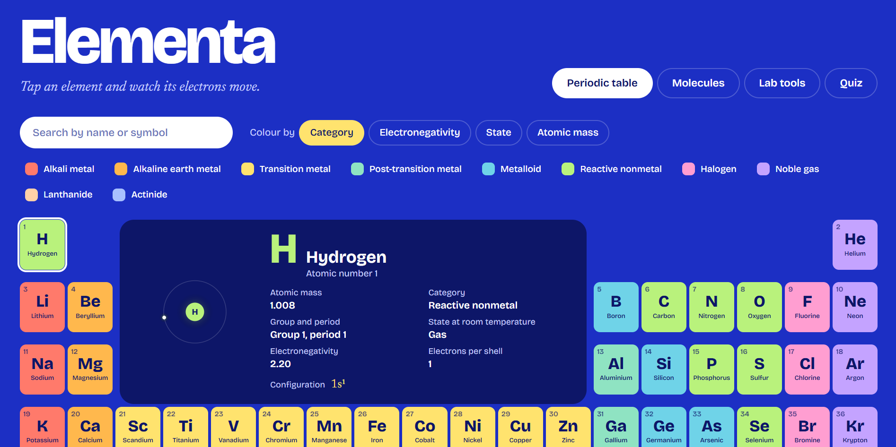

# Elementa ⚗️

**An interactive chemistry lab that runs entirely in the browser.**
Explore the periodic table with animated atoms, rotate molecules in 3D, calculate molar mass, balance chemical equations and test yourself with a quiz.

Built with **pure HTML, CSS and vanilla JavaScript**. No frameworks, no libraries, no build step. It is a single `index.html` file.

**Live demo:** [(https://saikatpaltonmoy.github.io/elementa/)]
<!-- Replace the link above after you deploy -->

<!-- Add a screenshot or GIF named screenshot.png next to this README -->

---

## Features

### Periodic table
- All **118 elements** laid out in the standard table, with the f-block shown separately
- Click, hover or use the **arrow keys** to explore. The detail card updates live
- An **animated Bohr-style atom** for every element, with electrons orbiting in their real shells
- Colour the table by **category**, **electronegativity**, **state at room temperature** or **atomic mass**
- Search by name or symbol, and click a legend item to highlight a category
- Electron configurations are calculated in code, including the known exceptions such as Cr, Cu, Ag, Au and U

### Molecules
- Eight molecules in an interactive **3D viewer** drawn on canvas: water, carbon dioxide, methane, ammonia, ethene, benzene, ozone and sulfur hexafluoride
- Drag to rotate, with optional auto-spin and atom labels
- Shape, bond angle and polarity for each molecule

### Lab tools
- **Molar mass calculator** with a formula parser that supports brackets and hydrates, for example `Ca(OH)2` and `CuSO4·5H2O`. It shows each element's share of the mass and converts grams to moles
- **Equation balancer** that solves for the smallest whole-number coefficients using exact fraction arithmetic (Gaussian elimination with `BigInt`) and shows an atom-count check

### Quiz
- Two modes, symbol to name and name to symbol
- Streak counter with the best streak saved in `localStorage`

### Accessibility and polish
- Fully keyboard accessible with visible focus styles
- ARIA labels, roles and live regions
- Respects `prefers-reduced-motion`
- Responsive layout. The detail card sits in the empty gap of the table on wide screens and moves above it on small screens

---

## Tech

| Area | What I used |
| --- | --- |
| Structure | Semantic HTML5 |
| Styling | CSS Grid, custom properties, responsive layout |
| Logic | Vanilla JavaScript (ES2020) |
| Graphics | Canvas 2D for the atom animation and the 3D molecule renderer |
| Storage | `localStorage` for the quiz best score |

---

## Run it locally

No install needed.

1. Download or clone this repository
2. Open `index.html` in your browser

---

## How some parts work

**3D renderer.** Each molecule is a list of atoms with `x, y, z` coordinates and a list of bonds. On every frame the points are rotated with a rotation matrix, projected with a simple perspective formula, sorted by depth and drawn back to front.

**Formula parser.** A small recursive parser reads element symbols, numbers, nested brackets and hydrate dots, and returns a map of element to atom count. Unknown symbols give a clear error message.

**Equation balancer.** The equation becomes a matrix where each column is a compound and each row is an element. Reactants count as positive and products as negative. Row-reducing the matrix finds the null space, which gives the coefficients. Fractions are scaled to the smallest whole numbers.

**Electron shells.** Configurations are generated from the Aufbau filling order, then corrected for the known exceptions. The shells in the atom animation are summed from that result.

---

## What I learned

- How to structure a larger vanilla JavaScript project without a framework
- Drawing and animating on canvas, including pointer-based interaction and device pixel ratio handling
- Writing a parser and doing exact maths with `BigInt` fractions
- Building accessible interfaces with keyboard navigation, ARIA and reduced-motion support
- Designing a colour system where one data set can be re-coloured in four different ways

---

## Ideas for next steps

- A drag-and-drop molecule builder
- Isotopes and ion charges in the balancer
- More molecules, with bond-length data
- A dark and light theme switch
- Installable offline app (PWA)

---

## Data notes

Atomic masses are rounded standard values and electronegativity uses the Pauling scale. Properties of elements after 103 are predicted, not measured.

## Author

Built by **Saikat Pal Tonmoy** after completing a frontend web development bootcamp.
[LinkedIn](https://www.linkedin.com/in/saikatpaltonmoy) · [GitHub](https://github.com/saikatpaltonmoy)
